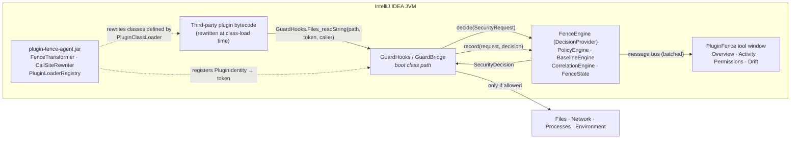
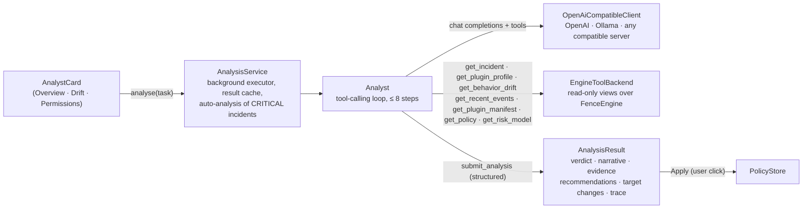
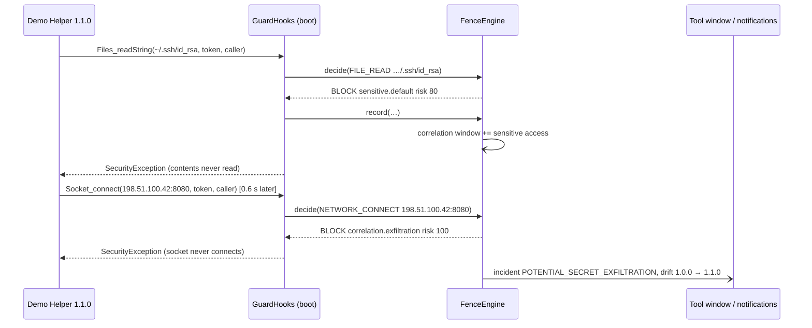

# PluginFence architecture

PluginFence is two cooperating pieces plus a tiny shared bridge:

| Piece | Module | Loaded by | Responsibility |
| --- | --- | --- | --- |
| **JVM agent** | `agent/` | system class path (`-javaagent`) | intercept, attribute, rewrite bytecode |
| **Bootstrap bridge** | `bootstrap/` | boot class path (`Boot-Class-Path`) | the one shared rendezvous point: hooks, requests, decisions |
| **IntelliJ plugin** | `intellij-plugin/` | IntelliJ `PluginClassLoader` | policy, baselines, drift, correlation, persistence, UI |

## 1. JVM agent (`com.pluginfence.agent`)

**Entry point:** `PluginFenceAgent.premain` (also `agentmain`). The manifest declares
`Premain-Class`, `Can-Retransform-Classes` and `Boot-Class-Path: plugin-fence-bootstrap.jar`,
which the JVM resolves next to the agent jar and appends to the boot class path *before*
`premain` runs. `premain` verifies that `com.pluginfence.bootstrap.GuardBridge` is defined by the
boot loader (falling back to `Instrumentation.appendToBootstrapClassLoaderSearch` if the sibling
jar was found but not applied) and only then references any bootstrap type - a broken install
degrades to "agent not active" rather than a startup failure.

**Selection (`PluginLoaderRegistry`).** The transformer is called for every class the JVM
defines. A class is a candidate only if its defining loader is an IntelliJ
`com.intellij.ide.plugins.cl.PluginClassLoader`. The loader's `getPluginId()` and
`getPluginDescriptor()` (name, version, vendor, `isBundled`) are read reflectively - the agent has
no compile-time dependency on IntelliJ - **once per loader**, cached in a weak map, and turned into
a `PluginIdentity` registered with `GuardBridge`, which returns an integer **token**.
PluginFence's own plugin and bundled plugins are skipped (`pluginfence.agent.instrumentBundled=true`
overrides the latter). Nothing is inferred from package names; trust comes from class-loader
evidence only. For tests, `pluginfence.agent.instrument.packages` forces instrumentation of given
packages with a synthetic identity.

**Rewriting (`HookRules`, `CallSiteRewriter`, `FenceTransformer`).** Only *invocation
instructions* inside candidate classes are touched; the platform, the JDK and the Kotlin stdlib
are never modified. Two shapes exist:

| Shape | Bytecode change | Used for |
| --- | --- | --- |
| **REPLACE** | `invokestatic/virtual Owner.m(desc)` → push `token`, `ldc callerClass`, `invokestatic GuardHooks.Owner_m(desc + I + String)`. Receiver of instance calls becomes the first parameter. The hook performs the original operation. | JDK APIs whose types are visible from the boot class path (`Files.*`, `Runtime.exec`, `ProcessBuilder.start`, `Socket.connect`, `URL.openConnection`, `System.getenv`, …) and `kotlin.io` functions, whose originals are invoked through the plugin's class loader (`Delegates`). |
| **PRECHECK** | `dup` (or `swap; dup; …; swap`, or `dup2`) the relevant argument, push `token`, caller and API name, `invokestatic GuardHooks.check*(Object, …)`; the original instruction stays. | Constructors (`new FileInputStream(File)`), receiver calls (`file.delete()`), and IntelliJ / `java.net.http` APIs whose types the boot class path cannot see (`VirtualFile.contentsToByteArray`, `GeneralCommandLine.createProcess`, `HttpRequests.request`, `HttpClient.send`). The hook reads what it needs reflectively via public exported supertypes. |

Both shapes are stack-neutral, add no branches or locals, and therefore keep existing
`StackMapTable` frames valid; `ClassWriter.COMPUTE_MAXS` recomputes the max stack without loading
any class (`COMPUTE_FRAMES` is deliberately avoided inside a class-load hook). ASM is shaded to
`com.pluginfence.agent.shaded.asm` so it can never clash with the IDE's own ASM. A thread-local
guard prevents re-entrant transformation while the registry's reflection loads classes. Any
failure leaves the class untouched and is counted in the diagnostics.

## 2. Bootstrap bridge (`com.pluginfence.bootstrap`)

Dependency-free Java 17 classes (~40 KB):

- `GuardHooks` - the static entry points named in the rule table. Each builds a redacted
  `SecurityRequest` (path normalised, URL user-info and credential-looking query parameters
  masked, command-line arguments sanitised, environment values never read), calls
  `GuardBridge.decide`, then `GuardBridge.record`, and either runs the original operation or
  throws `SecurityException` - the exception type the JDK documents for security-manager denials
  of the same APIs. Blocked `System.getenv(name)` returns `null` and enumerated environments are a
  filtered view (`GuardedEnvironment`), so plugins degrade gracefully instead of crashing.
- **Re-entrancy guard**: a thread-local depth counter. While a check runs, nested hooks pass
  through; the original operation always executes *outside* the guard so plugin callbacks (Kotlin
  lambdas in `forEachLine`, for example) stay protected. `GuardHooks.withGuard` lets the control
  plane persist and log without ever intercepting itself.
- `GuardBridge` - the process-wide singleton: provider registration, identity tokens,
  enforcement kill-switch, counters, agent diagnostics, and a bounded (512) buffer of events
  recorded before the control plane registered. With no provider every operation is allowed
  (`MONITOR` verdict) - PluginFence never bricks the IDE.
- `SecurityRequest`, `SecurityDecision`, `PluginIdentity`, `OperationType`, `Verdict`,
  `RiskLevel`, `DecisionProvider` - the contract.
- `Redactor`, `Targets`, `Delegates` - sanitisation, reflective target description, and
  reflective invocation of originals that live outside the boot class path.

Why the boot class path? IntelliJ's plugin class loaders are self-first and isolated from each
other; the only loader every class can reach is the bootstrap loader. That gives exactly one
`GuardBridge` per JVM, with one class identity. It also imposes a rule the code follows
carefully: bootstrap code may only reference `java.base` types (e.g. `java.net.http` is *not*
visible there, which is why `HttpClient.send` uses the pre-check shape).

## 3. IntelliJ plugin (`com.pluginfence`)

`FenceEngine` is an application-level service and the `DecisionProvider`. The plugin uses only
public platform API (the Plugin Verifier reports no internal, experimental or deprecated usages);
in particular the list of governed plugins comes from the identities the agent registered while
resolving plugin class loaders, not from the (internal) plugin registry API. The plugin compiles
against `bootstrap` with `compileOnly` and must **not** bundle it (a second copy inside the plugin
loader would break class identity). The domain model (`com.pluginfence.model`) has no bootstrap
dependency at all, and `AgentBridge` is the single class that touches bootstrap types; it is only
instantiated when `AgentProbe` finds `GuardBridge` on the boot loader. So the plugin, its UI and
its history work in "agent not active" mode too.

### Decision path (synchronous, on the intercepted thread)

`PolicyEngine.evaluate` does in-memory lookups only:

1. classify the target - `SensitivePathClassifier` (data-driven rules: directory segments, path
   suffixes, file names, extensions; separators normalised, `~` expanded, case-insensitive, no
   filesystem access), `SecretEnvClassifier`, `PathScope` (open project roots vs IDE-managed
   directories), `NetworkClassifier` (loopback, raw IP, plaintext), `ProcessClassifier`;
2. add context - `BaselineEngine.previousVersionProfile` (new behaviour after update) and
   `CorrelationEngine.recentSensitiveAccess` (sensitive access within the 10 s window);
3. sum deterministic `RiskFactor`s (clamped 0-100) and apply the precedence documented in the
   README (trusted → grant → user BLOCK → user ALLOW → approval → sensitive → secret env →
   correlation → process → project → outside → network → fallback).

`FenceEngine.record` (also synchronous) builds the immutable `FenceEvent`, notes sensitive
accesses in the correlation window immediately (so the next decision on any thread sees them),
and enqueues the event.

### Background path (single bounded executor)

Batches of events are appended to the bounded in-memory history, fed to `BaselineEngine.observe`
(profile per plugin+version; drift computed against the most recently seen other version),
`CorrelationEngine.observe` (incidents with the full attack chain), `FenceNotifier` (aggregated
IntelliJ notifications with Allow Once / Always Allow / Keep Blocking), persisted through
`FenceState` / `FenceHistory` (`PersistentStateComponent`, roaming disabled, bounded), and
published on the application message bus (`FenceListener`). The tool window coalesces
notifications with a 200 ms alarm and re-reads snapshots on the EDT - no UI work per event.

### Persistence

| File | Content |
| --- | --- |
| `pluginfence.xml` | settings, per-plugin policies (overrides + always-allowed targets), behaviour profiles, drift reports |
| `pluginfence-history.xml` | last 500 events and 100 incidents |

Both live in the IDE config directory; nothing leaves the machine.

### UI

`FenceToolWindowFactory` creates four tool-window `Content`s - so the IDE draws the tab strip
natively and each tab carries its own `ActionToolbar` - and `FenceToolWindowController` owns them:

| Tab | Content |
| --- | --- |
| **Overview** | Protection banner, four headline numbers that double as shortcuts into the other tabs, the incident feed, and the selected incident's attack chain on a numbered rail |
| **Activity** | Filterable event table (search, risk, plugin, action, prevented-only) with a detail pane covering the target, the rule and the per-factor risk breakdown |
| **Permissions** | One card per capability with an ALLOW / ASK / BLOCK switch, plus always-allowed targets |
| **Drift** | Old-vs-new version diff with NEW / UNCHANGED / REMOVED rows and a high-risk banner |

`ui/UiSupport.kt` is the design system the four tabs are assembled from: a semantic palette,
a type scale, and painted components (`FenceCard`, `Pill`, `RiskMeter`, `SegmentedControl`,
`ChainStep`, `Donut`, `WrappedText`). Every colour and surface is derived from the active theme
via `JBColor` / `UIUtil` / `ColorUtil` and every dimension goes through `JBUI.scale`, so the tool
window follows light/dark, custom themes and IDE zoom without a second code path.

Refreshes are coalesced (200 ms) and applied only to the visible tab; the others are marked stale
and rebuilt when selected. During an attack, events arrive in bursts - refreshing a background tab
would rebuild a combo box or switch the user is mid-click on, and burn EDT time nobody can see.

### AI security analyst (`com.pluginfence.ai`)

The only part of PluginFence that talks to a model, and it is strictly downstream of enforcement:
it reads what the engine recorded and proposes; a human applies; the deterministic policy is what
blocks. It is off until configured.

| Class | Role |
| --- | --- |
| `Analyst` | The agent loop. Sends the system prompt and task, executes the tool calls the model returns (echoing results with matching `tool_call_id`s), and stops at `submit_analysis`. A prose-only answer becomes an *inconclusive* result; the step budget forces a final submission; every I/O or protocol failure becomes a failed result, never an exception into the UI. |
| `AnalystTools` / `EngineToolBackend` | The tool table (OpenAI function-calling schemas) and their implementations. All read-only. `get_plugin_manifest` reads the suspect plugin's own `META-INF/plugin.xml` through the class loader the agent attributed its events to - real context about what the plugin *claims* to be. |
| `OpenAiCompatibleClient` | JDK `HttpClient` + the platform's bundled Gson. Chat Completions with `tools`; tolerant of servers that return tool arguments as objects. No streaming: the tool calls are the progress indicator. |
| `AnalysisService` | Application service. Runs analyses on a bounded pool, caches results per task key, dedups concurrent requests, publishes progress on the message bus (`AnalysisListener`), applies recommendations through `FenceEngine.setPolicy` / `PolicyStore.approve|revoke`, and - when enabled - analyses CRITICAL incidents as they arrive. |
| `AiSettings` / `AiConfigurable` | Endpoint, model, enable flags in `pluginfence-ai.xml`; the API key in the IDE credential store (`PasswordSafe`). `pluginfence.ai.*` system properties override everything for scripted runs. |
| `AnalystCard` | One card, three tasks (incident, update review, trust report), four states (not configured, idle, investigating with a live trace, result with Apply / Re-run / Show investigation). Subscribes on `addNotify` and disconnects on `removeNotify`, so it survives the panels being rebuilt on every refresh. |

Why a hand-written loop rather than an agent framework: the loop is ~150 lines, has no runtime
dependencies to reconcile with the IDE's class path, and can be read in full by a reviewer -
which matters when the reviewer's question is "what exactly can the model do here?" (answer:
call read-only tools and return JSON). The pattern is the one Koog formalises; swapping the loop
for it is future work, not a change of design.

## 4. Demo plugin

`demo-plugin/` builds **Demo Helper 1.0.0** (one benign action). `demo-plugin-update/` compiles the
same sources plus `src/update/` and its own `plugin.xml` into **Demo Helper 1.1.0** - a genuinely
different build of the same plugin ID. `runFenceIde` / `runFenceIdeUpdated` install one or the
other into a shared sandbox, so the second run is a real plugin update from PluginFence's point of
view. A `pluginfence.demo.autorun` property lets scripts drive the actions unattended
(`scripts/smoke-test.*`), and `scripts/check-sandbox-state.py` asserts on the persisted result.

## 5. Sequence: the attack chain

